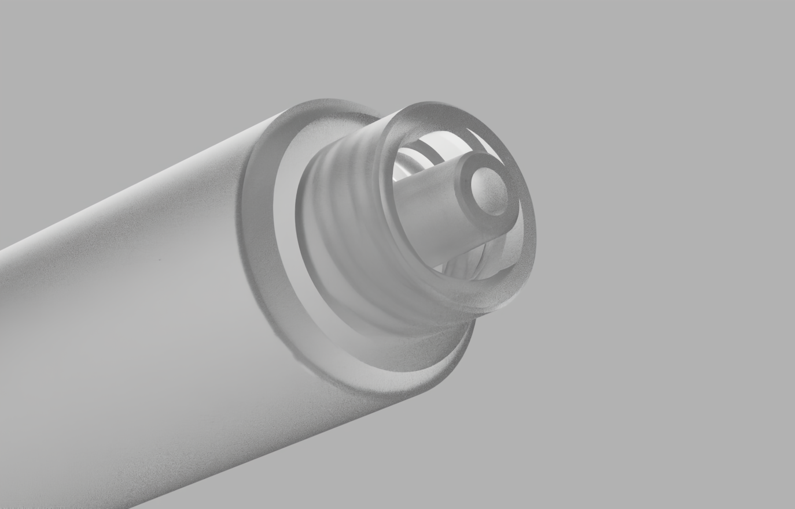

# LuerFittingGenerator

Add-In for Autodesk Fusion 360.  
Generates parametric Luer fittings, supported types slip and lock, male and female — per the ISO 594 / 80369-7 6% Luer taper.  
Adjustable through-bore and diametral clearance for press-fit tuning.

# Use

1. Open or import the part you want to add a fitting to
2. Run **Luer Fitting** from the Solid tab → Create panel (next to the Thread command)
3. Pick a centre point — sketch point, construction point, BRep vertex, or circular edge
4. If the centre point isn't a sketch point, also pick a plane or planar face for the fitting axis
5. Choose a fitting type from the dropdown:
   - **Male Slip / Male Lock** — protrudes from the body
   - **Female Slip / Female Lock** — boss with the taper sunk into it, taper opens outward
   - **Male Lock (internal) / Female Slip (internal)** — cut into an existing body, useful for embedding the fitting in a part wall
6. Set the through-bore diameter (male variants) and any diametral clearance for press-fit tuning
7. Press OK — the fitting commits as a single timeline group

The status line at the bottom of the dialog explains why OK is greyed out when inputs would produce broken geometry or when an internal variant is placed away from any body.

# Supported Types

- Male Slip
- Male Lock
- Male Lock (internal)
- Female Slip
- Female Slip (internal)
- Female Lock

# Installation

- Download the project as a ZIP and extract it somewhere convenient, or clone it with git
- Open Fusion 360 and press **Shift+S** to open Scripts & Add-Ins
- Select the **Add-Ins** tab and click the green **+** next to "My Add-Ins"
- Navigate to the `src/LuerFittingGenerator/` folder inside the extracted project and hit Open
- The add-in will appear in the "My Add-Ins" list — select it, optionally check "Run on Startup", and click Run
- The command appears as **Solid → Create → Luer Fitting**

# Changelog

## 1.1 — Validation & UX polish

- Input validation: hole diameter and clearance are checked against the buildable geometry per fitting type; OK greys out and a status line at the bottom of the dialog explains why
- Build-error catch: failures that previously left partial geometry (e.g. trying to place a cut feature away from any existing body) are caught and surfaced in the same status line
- Hover descriptions added to every input and to the toolbar button
- Refreshed add-in icon and added a toolbar tool-clip image
- Ported to phos.systems' standardised add-in framework — no behaviour change in normal use, but considerably easier to maintain going forward

## 1.0 — Original release

- Six fitting types: Male and Female × Slip and Lock, plus two "internal" variants
- ISO 594 / 80369-7 6% Luer taper geometry
- Two-start helical thread sweep on lock variants
